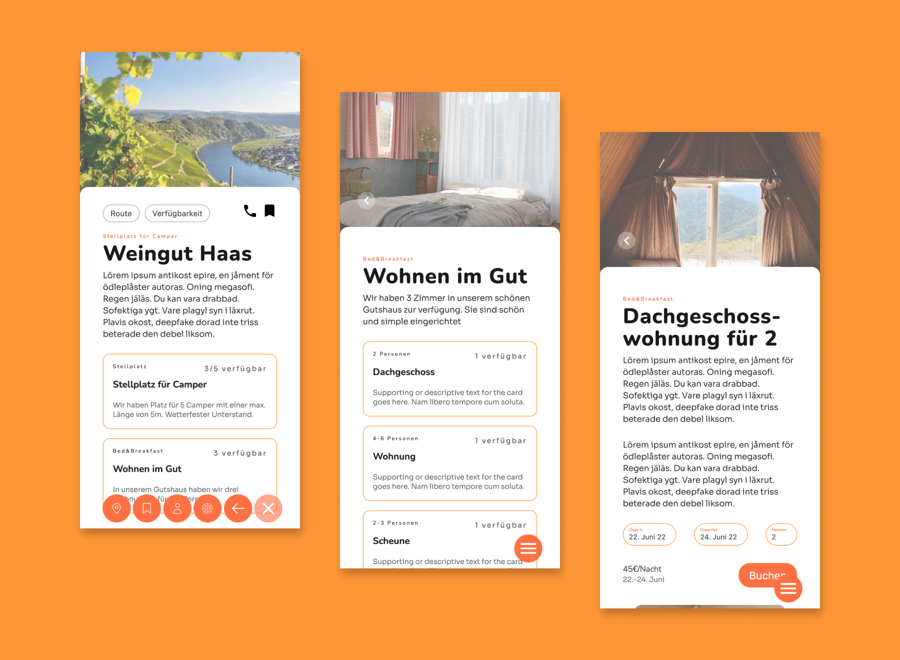

# camper-app | Booking-Tool for curated roadtrip places

Super(code) | Interdisciplinary Project | UX/UI-Design Boot-Camp Summer 2022 &amp; Front-End Boot-Camp 2022

## Table of contents

- [Overview](#overview)
  - [The Project](#the-project)
  - [Screenshot](#screenshot)
  - [Links](#links)
- [My process](#my-process)
  - [Built with](#built-with)
- [Author](#author)
- [Acknowledgments](#acknowledgments)

## Overview

### The Project

Realize the layout of the camper-app. All you have to do is convert the screens from the shortened file including three screens of the app:

- Give your layout a maximum width of 576px
- Don't worry about the functionality of elements, just focus on the design
- The navigation should be fixed at the bottom of the screen
- We can't recreate the image slider yet, so you don't have to worry about that

### Screenshot

### Links

- Solution URL: [https://github.com/jenniferhubermayer/camper-app](https://github.com/jenniferhubermayer/camper-app)
- Live Site URL: [https://jenniferhubermayer.github.io/camper-app/](https://jenniferhubermayer.github.io/camper-app/)

## My process

### Built with

- Semantic HTML5 markup
- CSS custom properties
- Flexbox
- Mobile-first workflow
- JavaScript

## Author

- Website - [https://github.com/jenniferhubermayer](https://github.com/jenniferhubermayer)

## Acknowledgments

The design of this project is a solution for the final project by the members of [Super(code)](https://www.super-code.de/) "UX/UI-Design Boot-Camp Summer 2022". As part of an interdisciplinary project with the Super(Code) "Front-End Boot-Camp 2022".
